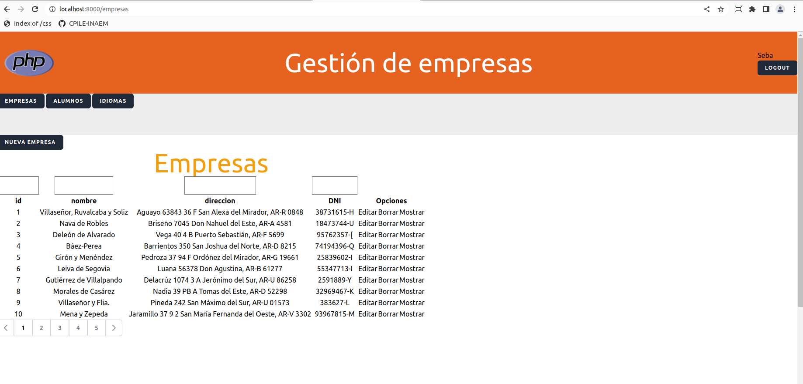
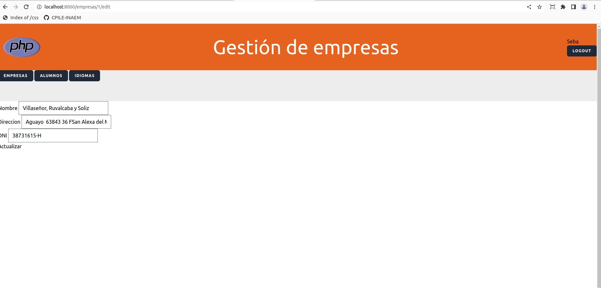
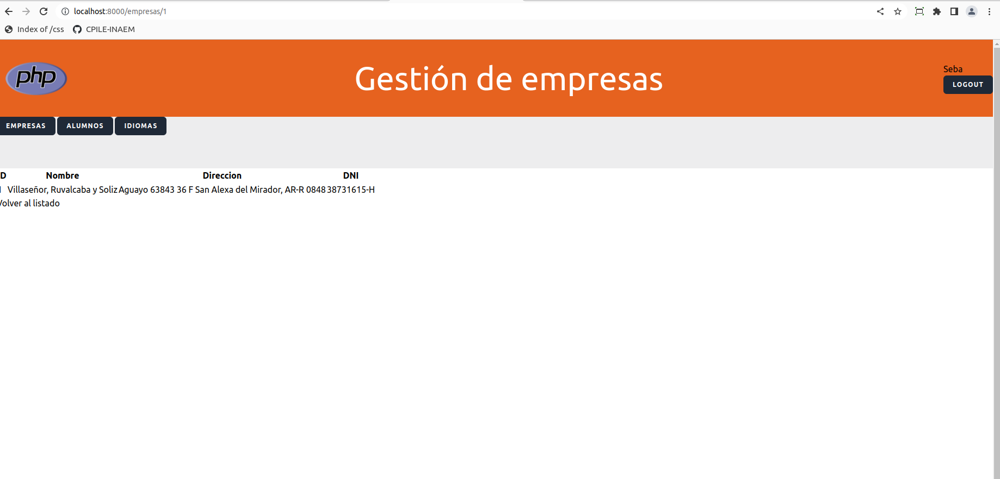

<p align="center"><a href="https://laravel.com" target="_blank"></a></p>

<p align="center">
<a href="https://github.com/laravel/framework/actions"></a>
<a href="https://packagist.org/packages/laravel/framework"></a>
<a href="https://packagist.org/packages/laravel/framework"></a>
<a href="https://packagist.org/packages/laravel/framework"></a>
</p>

## Proyecto empresas

Creo el proyecto nuevo

```shell
    laravel new empresas
```

### Requisitos

## R1 Instalar autentificación

Me ubico en el directorio del proyecto y ejecuto las siguientes instrucciones

1. Instalo breeze, me creará una carpeta en **_vendor/laravel/breeze_**

```shell
    composer require laravel/breeze
```

2. Publico las vistas, controladores y rutas en mi proyecto

```shell
  php artisan breeze:install
```

Al usar este comando seleccionamos la opción "Blade"

3. Instalo las herramientas de front (tailwind)

```shell
  npm install
```

4. Pongo en funcionamiento el servidor de base de datos

-   Cargo el fichero docker-compose.yaml en el directorio del proyecto
    [Fichero **_docker-compose.yaml_**](./docker-compose.yaml)

```yaml
docker compose up -d
```

-   Pongo disponible el servidor de base de datos

5. Edito el fichero **_.env_** para configurar la base de datos

```shell
    DB_CONNECTION=mysql
    DB_HOST=127.0.0.1
    DB_PORT=23307
    DB_DATABASE=empresas
    DB_USERNAME=sebas
    DB_PASSWORD=sebas
```

6. Ejecuto las migraciones

```shell
  php artisan migrate
```

7. Arranco las herramientas de cliente

```shell
    npm run dev
```

8. Puedo probar que está todo bien instalado, pruebo a hacer el login
   Abro el servidor

```shell
    php artisan serve &
```

# Clonar el proyecto y levantarlo

Clono el proyecto

```shell
    git clone https://...
    cd laravel_empresas
    composer update
    npm install
```

-   Verifico que tenga el fichero .env, si no lo consigo y genero la clave

```shell
    php artisan key:gen
```

-   Cargo las bases de datos

```shell
#Al estar funcionando con docker, lo levanto. El fichero se aporta con el proyecto
    docker compose up -d
    php artisan migrate
```

-   Levanto el proyecto y verifico su funcionamiento (el & es para no perder el terminal y ejecutar el proceso en background)

```shell
    php artisan serve &
    npm run dev
```

## [Diseño_de pantallas](./documentacion/diseño_layout.md)

## Modelo alumnos

-   Ahora creamos el modelo alumnos, el cual tendrá nombre, teléfono, email, un atributo multivaluado de idiomas y una clave foránea de empresas.

```bash
    php artisan make:model Alumno --all
```

-   También creamos el modelo Idioma porque al ser un atributo multivaluado necesitamos una nueva tabla

```bash
    php artisan make:model Idioma --all
```

-   En el archivo [create_alumnos_table.php](./database/migrations/2023_04_04_065957_create_alumnos_table.php) escribo lo siguiente para crear la tabla:

```bash
        Schema::create('alumnos', function (Blueprint $table) {
            $table->id();
            $table->timestamps();
            $table->string('nombre');
            $table->string('telefono');
            $table->string('email');
            $table->foreignId('empresa_id')->constrained();

        });
    }
```

-   En el archivo [create_idiomas_table.php](./database/migrations/2023_04_04_071709_create_idiomas_table.php) escribo lo siguiente:

```bash
    public function up(): void
    {
        Schema::create('idiomas', function (Blueprint $table) {
            $table->id();
            $table->foreignId("alumno_id")->constrained();
            $table->string('idioma');
            $table->timestamps();

        });
    }
```

-   En [AlumnoFactory.php](./database/factories/AlumnoFactory.php) pongo lo siguiente para poblar la tabla

```bash
    use App\Models\Empresa;
    use Illuminate\Support\Arr;

    public function definition(): array
    {
        // Con el siguiente código recibo un id de una empresa aleatoria
        $empresas=Empresa::all('id');

        //Convierto la colección a un array
        $empresas=$empresas->toArray();
        $empresa_id=Arr::random($empresas)['id'];

        return [
            'nombre'=>fake()->name(),
            'telefono'=>fake()->phoneNumber(),
            'email'=>fake()->email(),
            'empresa_id'=>$empresa_id
            //
        ];
    }
}
```

-   En [AlumnoSeeder.php](./database/seeders/AlumnoSeeder.php) lo siguiente:

```bash
    public function run(): void
    {
        // Aquí recojo a cada alumno y determino qué se hará con él, en este caso queremos que se le asigne 1,2 o 3 idiomas para cada alumno
        Alumno::factory()->count(50)->create()
            ->each(function ($alumno){
               $idiomas=['Inglés','Francés','Alemán','Ruso','Italiano','Portugés'];
               $num_idiomas=rand(0,5);
               if ($num_idiomas!=0){
               $idiomas_hablados=Arr::random($idiomas,$num_idiomas);
               foreach ($idiomas_hablados as $idioma_tupla){
                   $idioma=new Idioma();
                   $idioma->alumno_id=$alumno->id;
                   $alumno->idioma=$idioma_tupla;
                   $idioma->save();
               }
               }
            });

    }
```

-   En el [AlumnoController.php](./app/Http/Controllers/AlumnoController.php) ponemos:

```bash
    public function index()
    {
        //
//        $alumnos=Alumno::all();
        $alumnos=Alumno::paginate(15);
        return view("alumnos.listado_alumnos",['alumnos'=>$alumnos]);
    }
```

-   Establecemos la ruta en [web.php](routes/web.php)

```bash
use \App\Http\Controllers\AlumnoController;

Route::resource("alumnos",AlumnoController::class);
```

-   Creo el fichero "listado_alumnos.blade.php" dentro de la carpeta alumnos dentro de la carpeta views [listado_alumnos.blade.php](./resources/views/alumnos)

```bash
@extends('layout')
@section('main')
    <table>
        <caption>Listado de alumnos</caption>
        <tr>
            <th>ID</th>
            <th>Nombre</th>
            <th>Email</th>
            <th>Telefono</th>

        </tr>
        @foreach($alumnos as $alumno)
            <tr>
                @csrf

                {{--                <td>{{$empresa->id}}</td>--}}
                <td>{{$alumno->id}}</td>
                <td>{{$alumno->nombre}}</td>
                <td>{{$alumno->email}}</td>
                <td>{{$alumno->telefono}}</td>

            </tr>
        @endforeach

    </table>
{{$alumnos->links()}}
@endsection
```

-   Realizo las migraciones y pueblo las tablas:

```bash
php artisan migrante --seed
```

-   En [StoreAlumnoRequest.php](./app/Http/Requests/StoreAlumnoRequest.php) y en [UpdateAlumnoRequest.php](./app/Http/Requests/UpdateAlumnoRequest.php) ponemos los valores a true

```bash
    public function authorize(): bool
    {
        return true;
    }
```

-   En [DatabaseSeeder](./database/seeders/DatabaseSeeder.php) ponemos:

```bash
        $this->call([
            EmpresaSeeder::class,
            AlumnoSeeder::class
        ]);
```

-   Luego para poblar las tablas hacemos:

```bash
php artisan migrate:fresh --seed
```

# VUE

## Instalaremos Vue

El link del profesor a esto es: https://es.wikieducator.org/Usuario:ManuelRomero/Vue

-   Instalar Vue

```bash
 npm install vue@next --save-dev
```

-   Instalamos el plugin de vue para vite

```bash
  npm install @vitejs/plugin-vue
```

-   Vamos a [vite.config.js](vite.config.js), importamos vue

```bash
import vue from '@vitejs/plugin-vue';
```

-   Y luego establecemos en vite.config.js que utilizaremos el plugin "vue"

```bash
export default defineConfig({
    plugins: [
        vue(),
        laravel({
            input: [
                'resources/css/app.css',
                'resources/js/app.js',
            ],
            refresh: true,
        }),
    ],
});
```

-   Vamos a [app.js](./resources/js/app.js) y debemos importar Vue, escribimos en el fichero lo siguiente:

```bash
    import {createApp} from "vue/dist/vue.esm-bundler";
```

-   Especificamos en qué sección del HTML va a estar disponible y se monta especificando el id: '.mount("#app")'

```bash
createApp({
    components:{
        saludo,
        cronometro
        }
    }

).mount("#app");
```

-   Agrego en mi vista lo siguiente:

```html
<head>
    @vite(["resources/js/app.js","resources/css/app.css"])
</head>
<body>
    <div id="app">
        <saludo nombre="Pedro"></saludo>
    </div>
    <body></body>
</body>
```

-   Creamos el fichero saludo.vue dentro de resources->js->componentes

-   En app.js importamos el componente saludo.

```bash
  import saludo from "./componentes/saludo.vue";

  createApp({
    components:{
        saludo
        }
    }

).mount("#app");
```

-   En mi componente vue pongo lo siguiente:

```html
<template>
    <h1>Hola desde un componente vue</h1>
    Valor recibido desde fuera: {{nombre}}
    <hr />
    Valor generado dentro del componente: {{nombre_interno}}
    <hr />
    <button @click="dime_algo">Click me</button>
</template>
```

-Puedo retornar valores

```bash
    data(){
        return{
            valor1: 'Hola desde vue'
        }
    },
```

-   En mi componente vue puedo definir métodos

```bash
    methods:{
        dime_algo:function (){
            return alert("Valor de valor es "+this.valor1);
            }
    }
```

-   Al final mi componente queda así:

```bash
export default {
    name: "saludo", // Nombre del componente
    props:['nombre'], // En props pongo los atributos que voy a recibir de afuera
    data(){ // Esta función va a devolver las variables del componente
        return{
            nombre_interno: 'Hola desde vue'
        }
    },
    methods:{
        dime_algo:function (){
            return alert("Valor de valor es "+this.valor1);
            }
    }
}
```

# Implementación del CRUD en la tabla empresas utilizando componentes de VUE

Una vez creadas y pobladas nuestra tabla de empresas vamos a implementar el CRUD siguiendo los siguientes pasos:

-   En el fichero [EmpresaController.php](./app/Http/Controllers/EmpresaController.php) es donde definiremos nuestros métodos

1. Método index

```php
    public function index()
    {
        //
        // $empresas=Empresa::all();
        $empresas=Empresa::paginate(10);

        // Aquí me devuelve un array con el nombre de los campos
        $campos=array_keys($empresas[0]->getAttributes());

        // Lo siguiente es para eliminar del array los campos llamados created_at y updated_at
        unset($campos[array_search('created_at',$campos)]);
        unset($campos[array_search('updated_at',$campos)]);

//        return view("empresas.listado",['empresas'=>$empresas]);


        return view("empresas.listado",['filas'=>$empresas,'campos'=>$campos,'tabla'=>'Empresas']);
    }
```

2. Método create

```php
    public function create()
    {
    return view("empresas.create");
    }
```

3. Método store

```php
    public function store(StoreEmpresaRequest $request)
    {
        $valores = $request->input();
        $empresa = new Empresa($valores);
        $empresa->saveOrFail();

        $empresas=Empresa::all();
//        return view("empresas.listado",['empresas'=>$empresas]);
        return redirect(route("empresas.index"));

    }
```

4. Método show

```php
    public function show(Empresa $empresa)
    {
        return view("empresas.mostrar_empresa",['empresa'=>$empresa]);
    }
```

5. Método edit

```php
    public function edit(int $empresa)
    {

        $empresa = Empresa::find($empresa);
        return view("empresas.edit",['empresa'=>$empresa]);
    }
```

6. Método update

```php
    public function update(UpdateEmpresaRequest $request, int $empresa)
    {
        //
        $empresa=Empresa::find($empresa);
        $valores = $request->input();
        $empresa->update($valores);

//        $todas_empresas = Empresa::all();
//        return view("empresas.listado",['empresas'=>$todas_empresas]);
        return redirect(route("empresas.index"));

    }
```

7. Método destroy

```php
    public function destroy(int $empresa)
    {
        $empresa = Empresa::find($empresa);
        $empresa->deleteOrFail();

        // $todas_empresas = Empresa::all();
        $todas_empresas=Empresa::paginate(10);


//        return view("empresas.listado",['empresas'=>$todas_empresas]);


        // return redirect(route("empresas.index"));
        return response($todas_empresas);
    }
```

-   Nuestro componente VUE ubicado en [mitabla.vue](./resources/js/componentes/mitabla.vue) nos queda de la siguiente forma:

```js
<template>
    <table class="text-center">
        <h2 v-html="mensaje"></h2>

        <caption class="titulo">
            {{
                tabla
            }}
        </caption>
        <tr>
            <td v-for="(campo, indice) in campos">
                <input
                    @keyup="filtrar(campo, valor[indice])"
                    type="text"
                    v-model="valor[indice]"
                    :size="campo.length"
                />
            </td>
        </tr>
        <tr>
            <!--            En estas iteraciones recorro el array campos y me quedo con el valor campo, asimismo en las iteraciones siguientes recorro los arrays (los cuales están en plural) y me quedo con los valores en singular-->
            <th v-for="campo in campos">
                <button @click="ordenar(campo)">{{ campo }}</button>
            </th>
            <th colspan="3">Opciones</th>
        </tr>
        <tr v-for="fila in filas.data">
            <td v-for="valor in fila">{{ valor }}</td>

            <td>
                <button @click="editar(fila.id)">Editar</button>
            </td>

            <td><button @click="borrar(fila.id)">Borrar</button></td>

            <td><button @click="mostrar(fila.id)">Mostrar</button></td>
        </tr>
    </table>
    <tailwind-pagination :data="filas" @pagination-change-page="getResults" />
</template>

<script>
import axios from "axios";
import { TailwindPagination } from "laravel-vue-pagination";
export default {
    name: "mitabla",
    components: {
        TailwindPagination,
    },
    props: ["filas_serializadas", "campos_serializados", "tabla"],
    data() {
        return {
            filas: Array,
            campos: Array,
            ascendente: true,
            valor: Array,
            // filas_originales: Array,
            // len_campo: Array,
            mensaje: String,
        };
    },
    created() {
        this.filas = JSON.parse(this.filas_serializadas);
        this.campos = JSON.parse(this.campos_serializados);
        // this.filas_originales = this.filas;
        this.mensaje = "";
        // this.campos.array.forEach((campo, index) => {
        //     this.len_campo[index] = campo.lenght;
        // });
    },
    methods: {
        ordenar: function (campo) {
            this.filas.data = this.filas.data.sort((a, b) => {
                let retorno;
                if (a[campo] > b[campo]) retorno = this.ascendente ? 1 : -1;
                else retorno = this.ascendente ? -1 : 1;
                return retorno;
            });
            this.ascendente = !this.ascendente;
        },
        filtrar: function (campo, valor) {
            this.filas = JSON.parse(this.filas_serializadas);
            //this.filas = this.filas_originales;  En paginacion no funciona.
            this.filas.data = this.filas.data.filter((fila) => {
                let texto = new String(fila[campo]);
                if (texto.indexOf(valor) > -1) return fila;
            });
        },
        editar: function (id) {
            let url = window.location.href;
            url = url + "/" + id + "/edit";
            window.location.href = url;
        },
        mostrar: function (id) {
            let url = window.location.href;
            url = url + "/" + id;
            window.location.href = url;
        },
        getResults(page = 1) {
            let self = this;
            let url = window.location.href;
            axios
                .get(url + "/paginate?page=" + page)
                .then(function (response) {
                    self.filas = response.data;
                    console.log("Respuesta " + response.data);
                })
                .catch(function (error) {
                    console.log("ERROR" + error);
                });
        },
        borrar: function (id) {
            let url = window.location.href;
            if (url.endsWith("/")) {
                url = url.slice(0, -1);
            }
            url = url + "/" + id;

            axios
                .delete(url)
                .then((response) => {
                    this.filas = response.data;
                    this.mensaje =
                        "<span style='color:blue'>Se ha borrado en la tabla " +
                        this.tabla +
                        " la fila de id " +
                        id +
                        "</span>";
                })
                .catch((e) => {
                    this.mensaje =
                        "<span style='color:red'>Error borrando en la tabla " +
                        this.tabla +
                        "la fila de id " +
                        id +
                        "</span>";
                });
        },
    },
};
</script>

<style scoped>
.titulo {
    @apply text-amber-500 text-6xl;
}
</style>

```

-   Creamos la vista de empresas en [empresas.listado](./resources/views/empresas/listado.blade.php) invocando nuestro componente de VUE:

```php
@extends('layout')
@section('contenido')

    <x-anchor href="{{route('empresas.create')}}" >Nueva empresa</x-anchor>

    <mitabla filas_serializadas='@json($filas)' campos_serializados='@json($campos)' tabla='{{$tabla}}'>
    </mitabla>
```

-   Nuestra vista para editar los productos [empresas.edit](./resources/views/empresas/edit.blade.php) nos queda así:

```php
@extends('layout')
@section('contenido')

    <form action="{{route('empresas.update',$empresa->id)}}" method="post">
        @method('PUT')
        @csrf
        Nombre <input type="text" name="nombre" value="{{$empresa->nombre}}" id=""><br>
        Direccion <input type="text" name="direccion" value="{{$empresa->direccion}}" id=""><br>
        DNI <input type="text" name="DNI" value="{{$empresa->DNI}}" id=""><br>
        <button type="submit" value="Actualizar">Actualizar</button>
    </form>

@endsection

```

-   Definimos la ruta en [routes/web.php](./routes/web.php):

```php
<?php

use App\Http\Controllers\ProfileController;
use Illuminate\Support\Facades\Route;
use \App\Http\Controllers\EmpresaController;
use \App\Http\Controllers\AlumnoController;
use App\Http\Controllers\IdiomaController;

Route::get('/', function () {
    return view('welcome');
});

Route::get('/dashboard', function () {
    return view('dashboard');
})->middleware(['auth', 'verified'])->name('dashboard');

Route::middleware('auth')->group(function () {
    Route::get('/profile', [ProfileController::class, 'edit'])->name('profile.edit');
    Route::patch('/profile', [ProfileController::class, 'update'])->name('profile.update');
    Route::delete('/profile', [ProfileController::class, 'destroy'])->name('profile.destroy');
});

require __DIR__.'/auth.php';

Route::view('main','main');

Route::get("idiomas/paginate",[IdiomaController::class,"get_paginate"]);

Route::get("empresas/paginate",[EmpresaController::class,"get_paginate"]);

Route::resource("empresas",EmpresaController::class);
// Aquí mismo estoy definiendo cuál es el nombre de mi recurso
Route::resource("products",ProductoController::class);

Route::resource("alumnos",AlumnoController::class);

Route::resource("idiomas",IdiomaController::class);
```

-   Al final nuestra tabla empresas queda de la siguiente forma:
    

-   Así queda nuestra página de editar empresas:
    

-   Y así nos queda nuestra página de mostrar empresa
    
